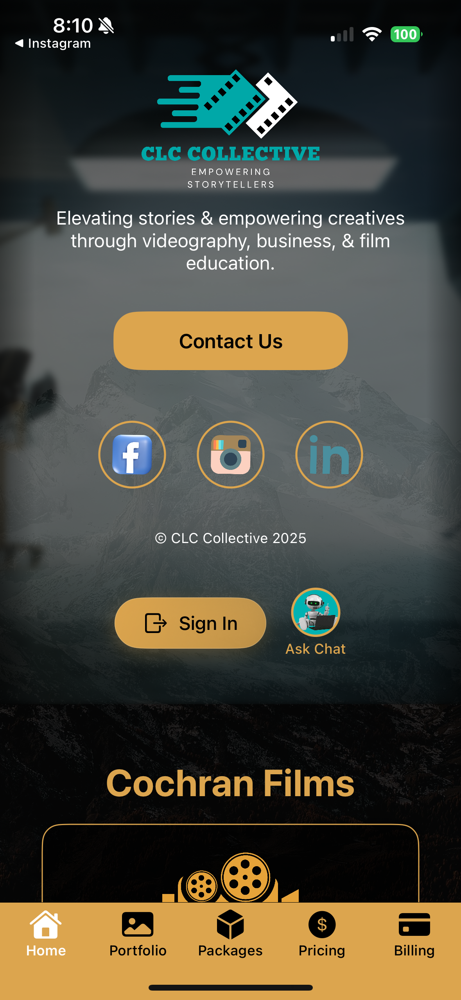
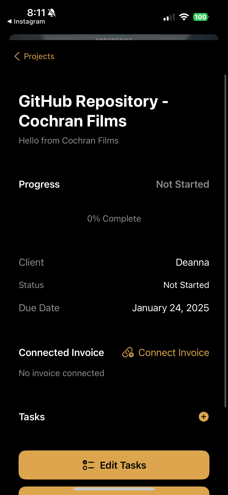

# CLC Collective

A powerful iOS app that combines the services of Cochran Films and Course Creator Academy, offering video production services and film education through in-person and virtual classes. Built with modern SwiftUI architecture and designed to provide a seamless experience for content creators and businesses alike.

<div align="center" style="display: flex; justify-content: center; gap: 20px;">
  
  
  
</div>

## 🔄 Recent Updates (January 2025)

### UI Enhancements
- **Streamlined Interface**
  - Removed redundant text titles for cleaner visual hierarchy
  - Enhanced Course Creator Academy logo presentation (250x250)
  - Optimized spacing between hero banner and logo
  - Added custom background for badge slideshow with feathered transitions

### Authentication Improvements
- Migrated to production Auth0 environment
  - Updated domain to `clc-collective.us.auth0.com`
  - Implemented production client credentials
  - Enhanced user authentication flow

### Visual Updates
- Added new background assets
  - Custom profile dashboard background
  - Stylized slideshow background
  - Improved visual consistency across views

## ✨ Features

### Content Creation
- Professional Video Production Services
- Videography Education Services
- Podcast Recording & Editing
- Online, interactive course completed at the creators pace
- Custom Package Solutions

### Business Tools
- Smart Project Management Dashboard
- Automated Invoice Generation
- Secure Payment Processing
- Client Portal with Real-time Updates
- Task Management

### Advanced Technology
- AI Assistant Integration for Content Ideas
- Real-time Project Status Updates
- Cloud-based Asset Management
- Multi-platform Portfolio Showcase

### Client Experience
- Intuitive Booking System
- Interactive Project Timeline
- Direct Communication Channels
- Custom Branding Options

## 🚀 Getting Started

1. Clone the repository:
```bash
git clone https://github.com/yourusername/CLCcollective.git
```

2. Install dependencies using Swift Package Manager in Xcode

3. Set up configuration (see Configuration section)

4. Build and run the project in Xcode

## ⚙️ Configuration

The app requires several API keys for full functionality. Create a `Config.plist` file in the `CLCcollective` directory using the template provided in `Config.template.plist`.

Required API Keys:
- OpenAI API Key (AI Assistant)
- Postmark Server Tokens:
  - Cochran Films Email Service
  - Course Creator Academy Email Service
- Wave API Token (Invoice Management)
- Auth0 Credentials (Authentication)

## 🛠 Tech Stack

- SwiftUI & Combine
- Core Data for local persistence
- CloudKit for cloud storage
- Auth0 for authentication
- OpenAI GPT for AI features
- Wave API for invoicing
- Postmark for transactional emails

## 📱 Compatibility

- iOS 15.0+
- iPadOS 15.0+
- Requires Xcode 14+
- Swift 5.5+

## 🤝 Support

We're here to help! Reach out through any of these channels:

- 📧 Email: support@cochranfilms.com
- 🌐 Website: https://www.cochranfilms.com
- 📱 In-App Support
- 💬 Discord Community

## 👥 Maintainers / Developer

- Cody Cochran ([@cochranfilms](https://github.com/cochranfilms))

## 📄 License

This project is proprietary software. All rights reserved.
© 2024 CLC Collective

## 🙏 Acknowledgments

Special thanks to our technology partners:
- Auth0 for secure authentication
- OpenAI for AI capabilities
- Postmark for reliable email services
- Wave for invoice management
- Our amazing beta testers and early adopters

<div align="center">
Made with ❤️ by CLC Collective
</div>
