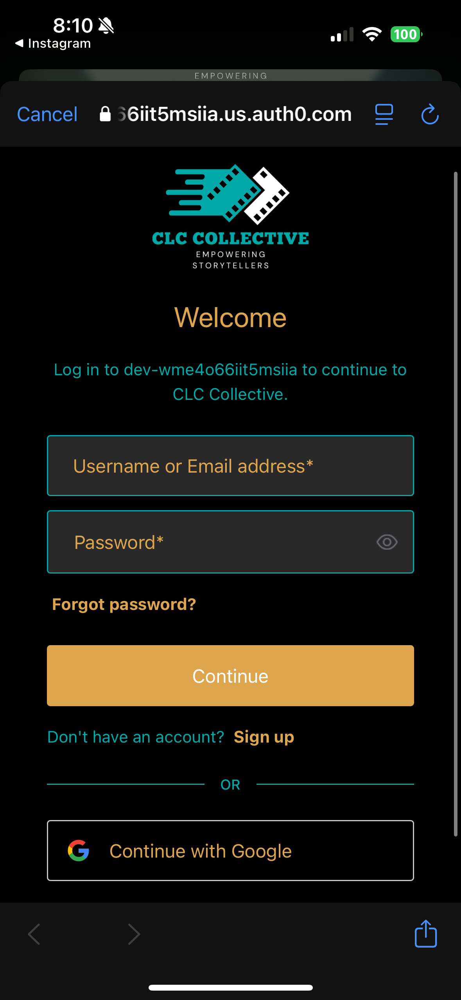

# CLC Collective

A powerful iOS app that combines the services of Cochran Films and Course Creator Academy, offering video production services and course creation tools. Built with modern SwiftUI architecture and designed to provide a seamless experience for content creators and businesses alike.

<div align="center" style="display: flex; justify-content: center; gap: 20px;">
  
  
  
</div>

## ✨ Features

### Content Creation
- Professional Video Production Services
- Podcast Recording & Editing
- Course Creation & Development Tools
- Custom Package Solutions

### Business Tools
- Smart Project Management Dashboard
- Automated Invoice Generation
- Secure Payment Processing
- Client Portal with Real-time Updates

### Advanced Technology
- AI Assistant Integration for Content Ideas
- Real-time Project Status Updates
- Cloud-based Asset Management
- Multi-platform Portfolio Showcase

### Client Experience
- Intuitive Booking System
- Interactive Project Timeline
- Direct Communication Channels
- Custom Branding Options

## 🚀 Getting Started

1. Clone the repository:
```bash
git clone https://github.com/yourusername/CLCcollective.git
```

2. Install dependencies using Swift Package Manager in Xcode

3. Set up configuration (see Configuration section)

4. Build and run the project in Xcode

## ⚙️ Configuration

The app requires several API keys for full functionality. Create a `Config.plist` file in the `CLCcollective` directory using the template provided in `Config.template.plist`.

Required API Keys:
- OpenAI API Key (AI Assistant)
- Postmark Server Tokens:
  - Cochran Films Email Service
  - Course Creator Academy Email Service
- Wave API Token (Invoice Management)
- Auth0 Credentials (Authentication)

## 🛠 Tech Stack

- SwiftUI & Combine
- Core Data for local persistence
- CloudKit for cloud storage
- Auth0 for authentication
- OpenAI GPT for AI features
- Wave API for invoicing
- Postmark for transactional emails

## 📱 Compatibility

- iOS 15.0+
- iPadOS 15.0+
- Requires Xcode 14+
- Swift 5.5+

## 🤝 Support

We're here to help! Reach out through any of these channels:

- 📧 Email: support@cochranfilms.com
- 🌐 Website: https://www.cochranfilms.com
- 📱 In-App Support
- 💬 Discord Community

## 👥 Maintainers

- Cody Cochran ([@cochranfilms](https://github.com/cochranfilms))

## 📄 License

This project is proprietary software. All rights reserved.
© 2024 CLC Collective

## 🙏 Acknowledgments

Special thanks to our technology partners:
- Auth0 for secure authentication
- OpenAI for AI capabilities
- Postmark for reliable email services
- Wave for invoice management
- Our amazing beta testers and early adopters

<div align="center">
Made with ❤️ by CLC Collective
</div> 